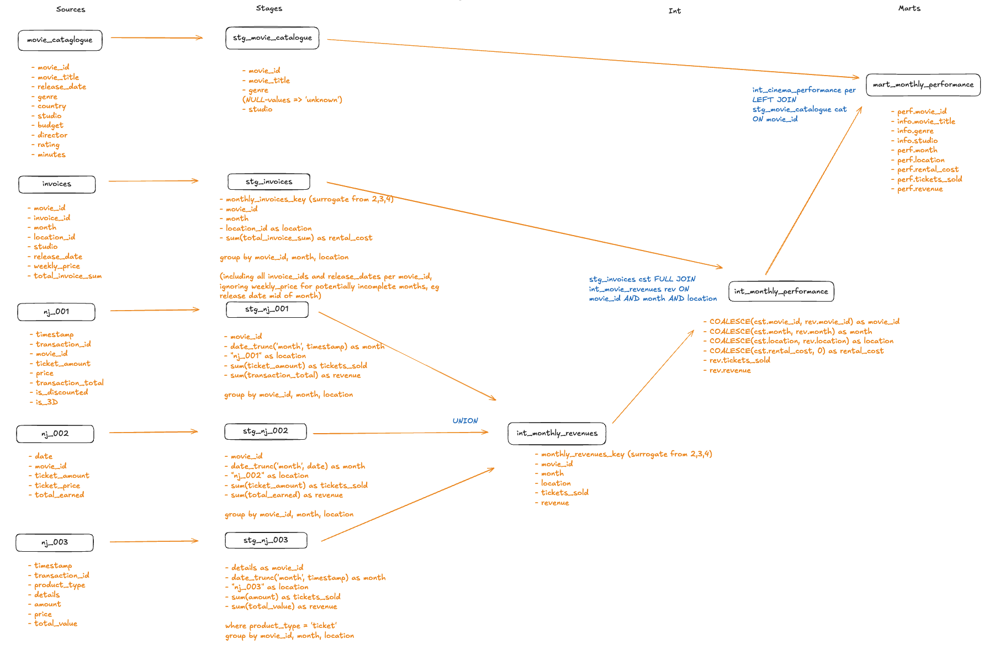
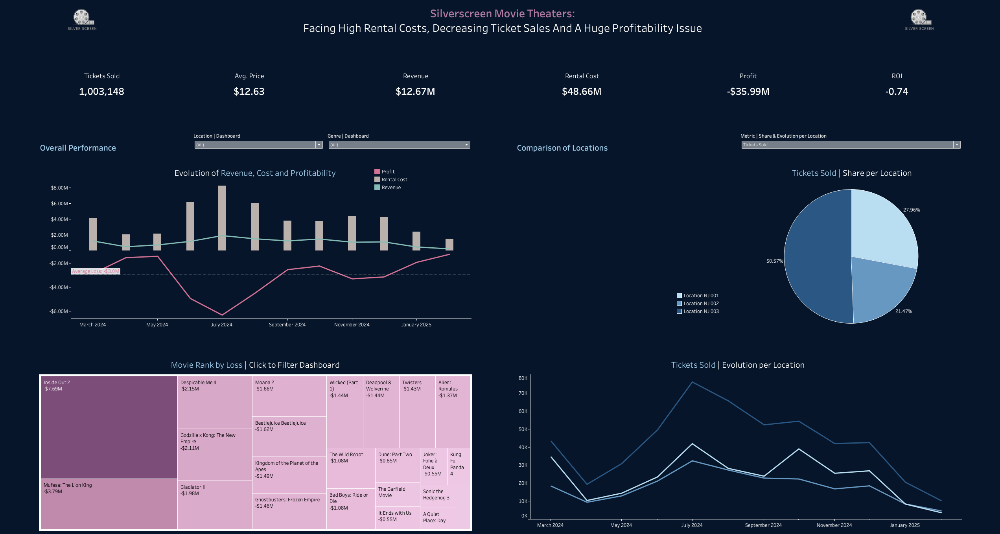
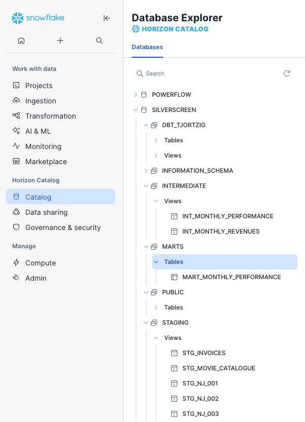

# Cinema Profitability Modeling & Performance Analysis (Silverscreen Case Study)

**Evaluating the business impact of a cinema chain acquisition**  
*A modular dbt Cloud pipeline running on Snowflake to model revenues, costs, and monthly profitability.*

---

## 🧭 Business Context & Objective  

After acquiring a small cinema chain in New Jersey, an entertainment company wanted to assess whether its new theaters were operating profitably.  
As the assigned **BI Analyst**, my goal was to build a transparent data foundation to evaluate **monthly revenues, rental costs, and profit per location and movie**.  

During the analysis, several data inconsistencies appeared (e.g., conflicting release dates and inflated rental costs), suggesting the company’s previous reporting lacked accuracy.  
To address this, I developed a **modular data transformation pipeline in dbt Cloud**, running on **Snowflake**, to consolidate, clean, and model all sources into a reliable profitability table.

---

## 🧱 Architecture & Tech Stack  

The project applies a **three-layer dbt architecture** (`staging → intermediate → marts`), ensuring full lineage and reproducibility.  
Sources are referenced but not part of the dbt model layers.

| Component | Purpose |
|------------|----------|
| **dbt Cloud** | Transformation and orchestration platform for SQL-based models |
| **Snowflake** | Target data warehouse |
| **GitHub** | Version control for dbt models, macros, and documentation |
| **dbt_utils** | Used for surrogate keys and accepted range tests |
| **codegen** | Generates YAML model documentation |
| **YAML files** | Store schema definitions and tests |
| **Custom + Generic Tests** | Validate data integrity across all model layers |

---

## 🎬 Data Sources  

| Source | Description |
|:--|:--|
| `movie_catalogue` | Metadata for all movies (title, genre, studio, release date, director, etc.). |
| `invoices` | Monthly rental invoices with pricing and cost information per movie and cinema. |
| `nj_001` | Transaction-level ticket sales from Cinema 1. |
| `nj_002` | Daily ticket sales feed from Cinema 2. |
| `nj_003` | Mixed transactions (tickets, snacks, drinks) from Cinema 3. Only ticket data is relevant. |

> ⚠️ **Data quality observations:**  
> Some invoices contain conflicting `release_date` values or unrealistic rental costs (e.g., invoice total equals 4× the weekly rate, even if release date is mid-month in question).  
> These anomalies were documented but not adjusted, as no clear business rules were available. **Assumption:** each distinct `invoice_id` represents a billable record and is therefore included.
> Several attributes in movie_catalogue contain missing values (`NULL`). For `genre` this is addressed during staging.

---

## 🧮 Modeling & Data Lineage  

All models follow a clean dbt layer logic:

```text
sources  →  staging  →  intermediate  →  marts
```

### Staging Models (`stg_`)

| Model | Purpose |
|:--|:--|
| `stg_movie_catalogue` | Cleans and standardizes movie metadata. |
| `stg_invoices` | Aggregates invoice data at `(movie_id, month, location)` level. Creates surrogate key `monthly_invoices_key` for testing and joins. |
| `stg_nj_001` | Converts ticket data from Cinema 1 to monthly grain. Standardizes column naming. |
| `stg_nj_002` | Aggregates daily sales from Cinema 2 to monthly level. Standardizes column naming. |
| `stg_nj_003` | Filters ticket transactions for Cinema 3 and aggregates monthly. Standardizes column naming. |

### Intermediate Models (`int_`)

| Model | Purpose |
|:--|:--|
| `int_monthly_revenues` | Combines monthly ticket data from all cinemas (UNION). Creates surrogate key `monthly_revenues_key`. |
| `int_monthly_performance` | Joins revenues with invoice data using a full join on `surrogate keys`. Includes all movies, even with missing sales or rental data. |

### Mart Models (`marts_`)

| Model | Purpose |
|:--|:--|
| `mart_monthly_performance` | Final profitability table per movie, cinema and month with derived KPIs. |

### KPI logic

```sql
profit = revenue - rental_cost  
roi = profit / rental_cost
```

Snowflake’s `DIV0()` handles division-by-zero cases safely.

---

### DAG Overview  

The diagram below shows the complete dbt model lineage:  


Concept sketch (project overview):  


This flow illustrates the stepwise enrichment from raw source data to the final analytical mart —  
ensuring full traceability from invoice and sales inputs to profitability metrics.

---

## 🧪 Testing & Data Quality  

Testing ensures correctness and consistency across all model layers.
> Design note: The project intentionally mixes test types to showcase alternatives.

| Layer | Test Types | Focus |
|:--|:--|:--|
| **Sources** | Singular tests (`no_negative_values`) | Validate raw ticket data |
| **Staging** | `not_null`, `unique`, `no_negative_values` | Data integrity and completeness |
| **Intermediate** | `not_null`, `unique`, `dbt_utils.accepted_range` | Range checks for metrics |
| **Marts** | `not_null`, `dbt_utils.accepted_range` | KPI validation |

All tests pass successfully on the training dataset.  
Surrogate keys (`monthly_invoices_key` & `monthly_revenues_key`) support uniqueness tests and simplify joins.

---

## ⚙️ Deployment & Environments  

The project runs in **dbt Cloud** with **Snowflake** as the warehouse.  
All models are organized into environment-specific schemas controlled by a custom macro.

| Layer | Schema | Purpose |
|:--|:--|:--|
| **Sources** | `public` | Raw input tables |
| **Development** | `dbt_tjortzig` | Developer schema for model creation and testing |
| **Production** | `staging`, `intermediate`, `marts` | Cleaned and analytical outputs |

### Materialization strategy

| Layer | Materialization | Rationale |
|:--|:--|:--|
| `stg_` | `view` | Lightweight transformations |
| `int_` | `view` | Flexibility during analysis |
| `mart_` | `table` | Performance for reporting |

### Job execution

Go to **Orchestration → Jobs**, select the **Prod_SilverScreen** job and click **Run now**.
This builds all models in dependency order, runs tests, applies the production schema naming logic from the custom macro, and generates documentation.

---

## 💡 Key Learnings & Next Steps  

### Key Learnings  

- Applied modular **dbt architecture** with clear separation of logic and environments.  
- Combined **custom and package-based testing** for data quality validation.  
- Implemented **surrogate keys** for referential integrity.  
- Handled **data inconsistencies transparently** to reflect real BI challenges.  
- Built a **reproducible deployment setup** in dbt Cloud with documentation generation.  

### Next Steps  

- 🔍 Define business rules for invoice validation.  
- ⚙️ Optimize intermediate models for larger data volumes.  
- 📈 Extend analysis by genre, studio, or location group.  
- 🕒 Add historical snapshots for trend tracking.  
- 🧭 Build dashboards for ROI and film performance visualization.

---

## 📊 Example Visualization  

A Tableau dashboard visualizes monthly revenues, rental costs, and ROI across all cinema locations.

[🔗 View on Tableau Public](https://public.tableau.com/views/Silverscreen_Dashboard/Overview?:language=de-DE&:sid=&:redirect=auth&:display_count=n&:origin=viz_share_link)

**Key insights from the analysis:**
- All three cinemas operate at a loss — primarily due to uniform rental costs that exceed revenues.
- **Location NJ003** performs *relatively best*:  
  - 50.6% of all tickets sold, 46.1% of total revenue, but only 28.4% of total losses.  
  - Lowest average ticket price ($11.5), suggesting better volume efficiency.
- **Location NJ002** is the weakest performer:  
  - 21.5% of tickets sold, 22.9% of revenue, but 37% of total losses.  



---

## 🧊 Data Warehouse View  

The final models are deployed in **Snowflake**, organized by dbt environment layers:



This structure mirrors the dbt model hierarchy (`staging → intermediate → marts`)  
and ensures full lineage and environment separation.

---

## 👨‍💻 Author  

**Thomas Jortzig**  
Cinema Profitability Modeling & Performance Analysis – Silverscreen Case Study (10/2025)
